# Project FormOCR

---

## 목표

**Image to document file**
- 이미지로 되어있는 양식 (하드카피된 양식의 스캔본이라 가정)을 문서파일(ex. xlsx)로 생성

 - 스캔또는 촬영 된 Form 이미지를 이용
    Form 의 재사용성을 높이고, 유사한 Form의 재생산을 막아 효율적인 사무업무 처리를 위한 프로그램

    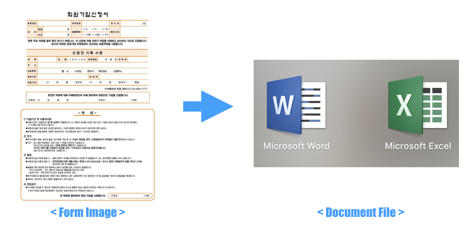

---

## 준비사항

 기본적으로 OpenCV 라이브러리와 OCR을 위한 Tesseract 라이브러리가 필요합니다.

**라이브러리**

 - openCV (https://opencv.org/releases.html)

 - Tesseract Open Source OCR Engine (https://github.com/tesseract-ocr/tesseract)

**개발환경 및 툴**

 - Python 3.6
 - MacOS tesseract 4.0 beta
 - IDE : JetBrains PyCharm

---

## Point

### Form 추출

먼저, 전체에서 반듯한 직선만을 추출해 표라는 것을 인식하고, 추출.
적절하게 divide & merge 작업을 거쳐 표를 만들어야 한다.

### Tesseract에서 권장하는 환경

> 1) 폰트 크기 약 11-13pt 사이
> 2) 300dpi 이상의 이미지
> 3) 글자가 반듯하게 나오도록 Rotation
> 4) **글자 외의 Table이나 Border 삭제**
> 5) **문장별로 적절하게 분할**

**이미지에서 양식과 글자를 나누어서**
양식으로 **표**를 먼저 그리고,
표를 지운 이미지에서 **글자를 추출**해
셀 위에 글자를 삽입하자라는 관점에서 시작!

---

## Workflow

### overview

1. Preprocessing
2. OCR cells
3. Export to document

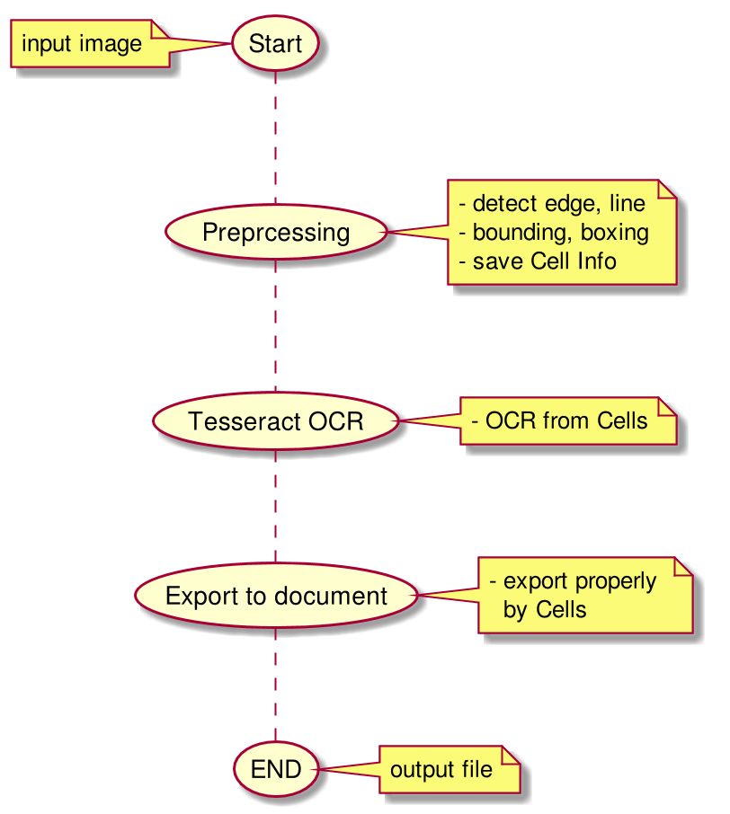

---

### class Cell()

document를 구성하기 위해서는 image의 표에 대한 정보필수.
크게 세가지 정보를 가진다.
 - 표의 위치정보(좌표)
 - Cell이 포함하고 있는 text에 대한 정보
 - 경계선(boundary)의 정보
```python
class Cell(object):
    def __init__(self):
        self.x = None
        self.y = None
        self.width = None
        self.height = None

        self.central_x = None
        self.central_y = None

        self.text = None
        self.text_height = None
        self.text_align = 'center'
        self.text_valign = 'center'

        self.boundary = {
            'left': False,
            'right': False,
            'upper': False,
            'lower': False
        }
```

---

### Class diagram

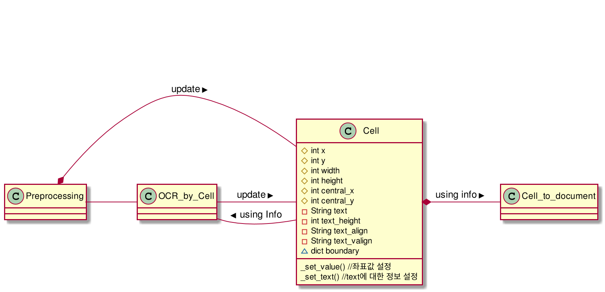

---

### 1) Preprocessing

## Overview

### - 목표
Image파일을 불러와 라인과 텍스트를 나누고 
OCR을 수행하고 Document file로 만들어내기 위해
적절히 Cell값을 나누어 Cell객체의 정보를 저장한다.

**Work flow**
​    1. Original Image의 contour 추출
​    2. 추출된 contour를 통해 Box bounding
​    3. bounding된 Box로 원본 이미지의 **불완전한 표를 보완**
​    4. **line_image(라인만 있는 이미지**)와 **erase_line(라인을 제거한 이미지**)로 분리
​    5. line_image에서 표에 대한 정보를 얻기 위해 필요한 x축, y축의 갯수를 구하고 `class Cell()`객체에 Cell에 대한 정보를 저장
​    6. Original image의 실제 모습과 유사하게 현재 Cell들을 **Merge**하여 저장

---

### - Methods

```python
def boxing_ambiguous(): 
# 불완전한 사각형이나 선이 제대로 잡혀있지 않은 사각형을 완성시켜준다.
def detect_contours(): 
# 표에 대한 정보를 얻으며, line_image(라인만 있는 이미지)와 erase_line(라인을 제거한 이미지)로 분리한다.
def cal_cell_needed():
# line_image를 통해 document file을 생성하는데 필요한 cell의 개수를 구하기 위해 필요한 x_axis와 y_axis의 리스트를 구한다.
def save_cell_value():
# x_axis와 y_axis의 정보로 x,y,width,height,central_x,y의 정보를 Cell객체에 저장한다
def find_cell_boundary():
# 좌표정보를 이용하여 상하좌우 boundary유무의 정보를 저장한다.
def merge_cell():
# 도출해낸 cell에 대한 정보를 토대로 Original Image와 유사하게 Cell을 merge
```

### - Example
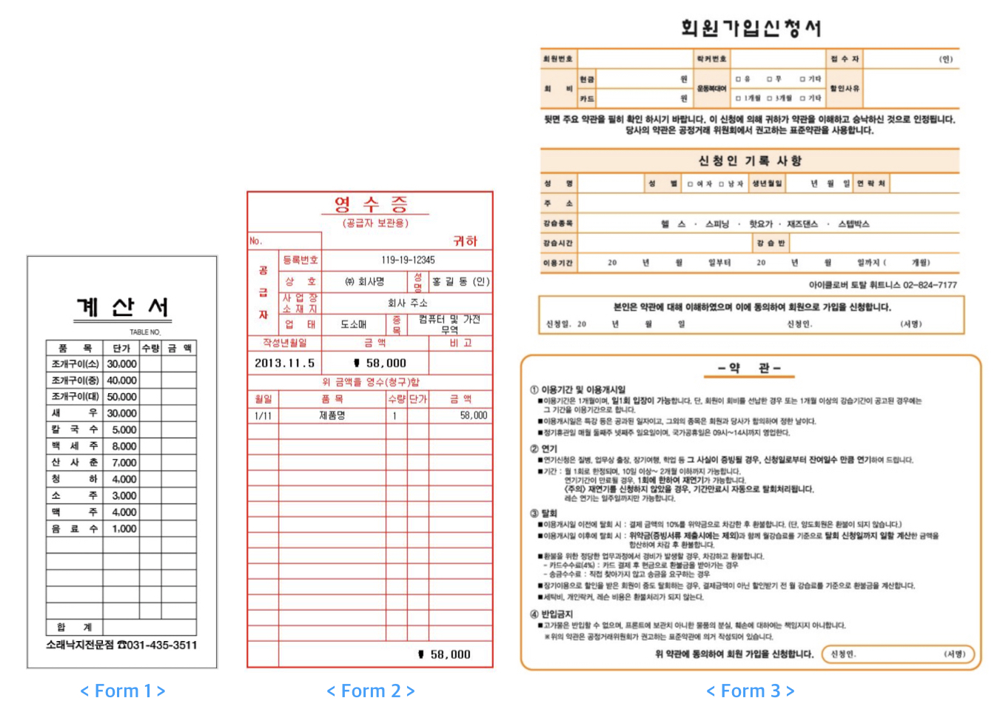

## Attempt! Form 추출
**< Original Image>**
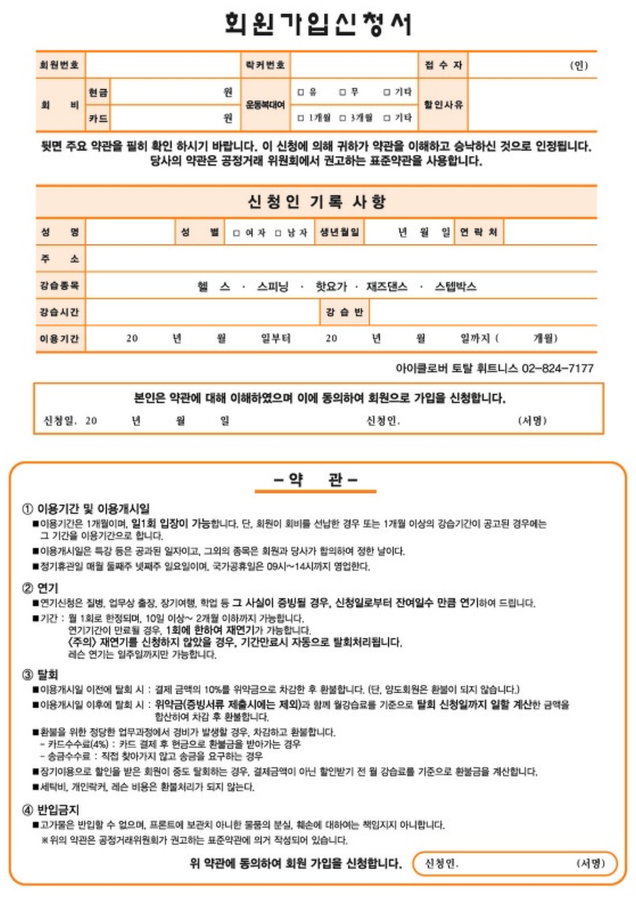

---

### Trial 1
 `cv2.HoughLinesP()`메소드를 이용해보자! (edge추출의 Canny알고리즘 이용)
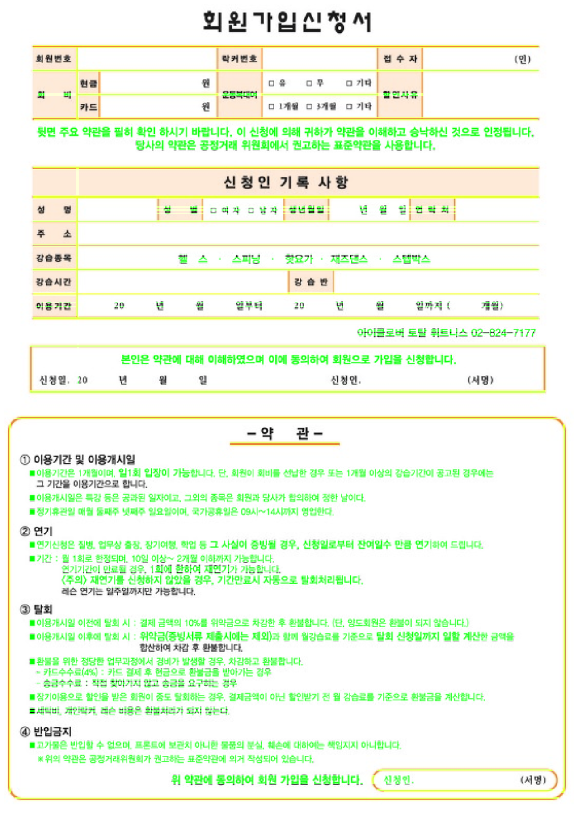
**Problem!**
글자사이 생기는 line과 표를 구분할 수 있는 적합한 파라미터를 조정할 수 없음!

---

### Trial 2
 `cv2.findContours()`메소드를 이용해보자! (`cv2.threshold()`이용)
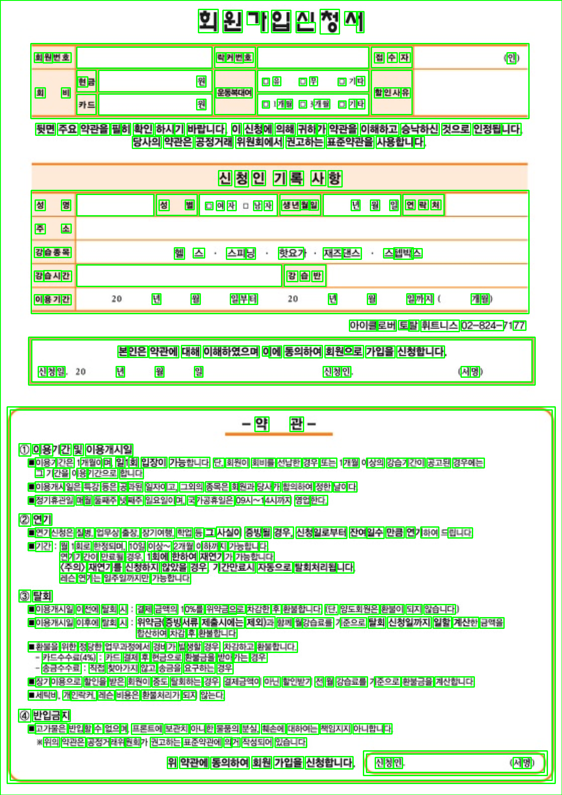
**Problem!**
웹 상에 흔히 돌아다니는 오픈소스를 사용하면 min_width, ,min_height를 조정하여 크기에 따른 contour추출밖에 할 수 없음!
**제목과 같은 큰 Contours**와 **표를 이루는 작은 셀의 Contours**와의 구분점을 일일이 찾아줄 수 밖에 없음

---

### Trial 3 
그렇다면 Contours 그룹간의 **Hierarchy 구조**를 이용해보자!
`cv2.RETR_CCOMP`를 파라미터로 사용하면 Hierarchy를 2-Level로 표현한다. 
바깥쪽(외곽선)은 모두 1-Level, 안에 포함된 것은 2-Level이 된다.

```python
_, contours, hierarchy = cv2.findContours(thr, cv2.RETR_CCOMP, cv2.CHAIN_APPROX_SIMPLE)
```

그렇지만 이 또한 글자 내에 생기는 Contours그룹이 생기므로 Hierarchy구조가 꼬이게 되며, 글자와 Form이 합쳐진 Image에 적합하지 않다.

따라서
 >child가 없는 contour == 최내곽
 >
 >parent가 최외곽 or 최외곽-1인 contour

 이 점을 이용하여 표를 추출하자!

```python
if (width > min_width and height > min_height) and ((hierarchy[0, i, 2] != -1 or hierarchy[0, i, 3] == (len(hierarchy) - 2 or len(hierarchy) - 1)) or cv2.arcLength(contour, True) > 1000):
```
---

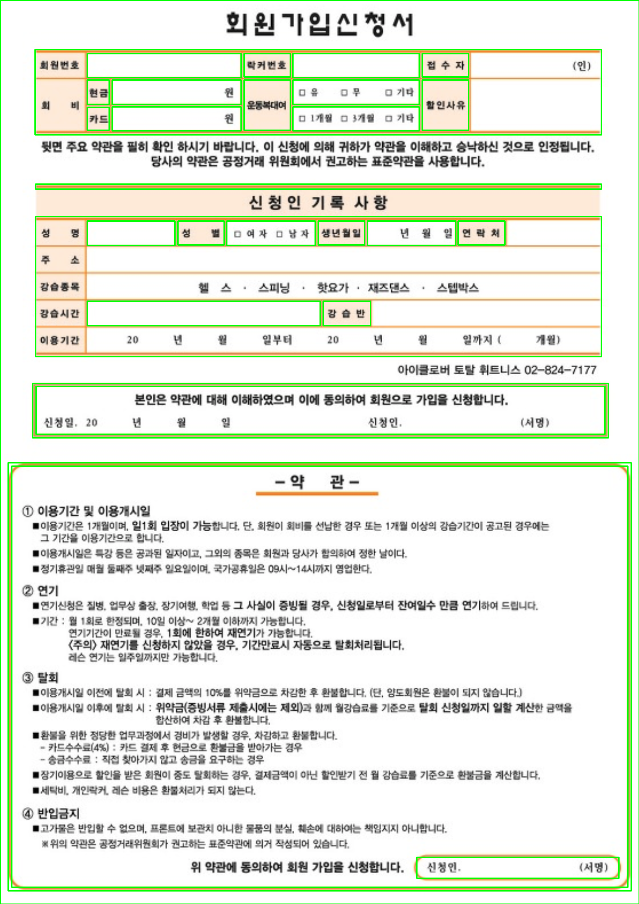
**Problem!**
그럼에도 **불분명한 경계선** 때문에 표 전부를 완벽하게 추출할 수 없음
**Solution!**
이렇게 추출된 Contours 사각형을 이용해 경계선을 그리고 다시 추출해보자!


## Solution!
### def boxing_ambiguous()
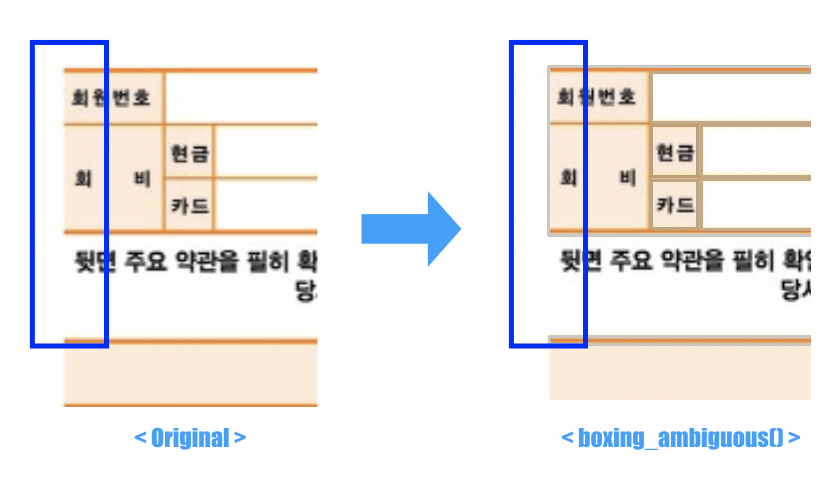

<span style="color:#0052cc">파란색</span>으로 표시된 것처럼 경계면이 명확한 선으로 표현되어 있지 않거나, 명암이 불분명한 경계선에 확실한 구분점을 주어 contour인식률을 높인다.

---

### def detect_contours()

위 과정 `def boxing_ambiguous()`를 통해 경계선을 명확하게 만들었으므로 좀 더 수월하게 **목표하는 contours**를 추출할 수 있다.
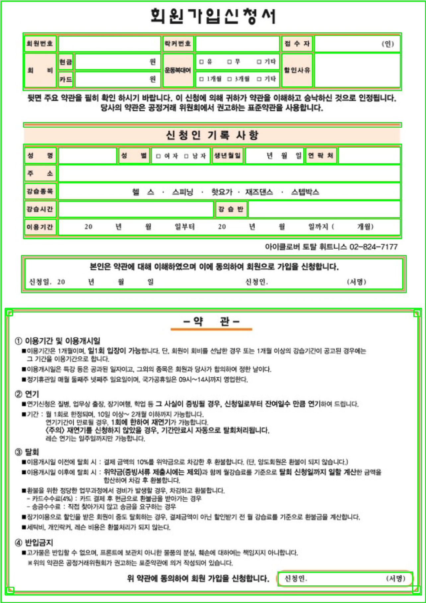

---
이렇게 추출한 contours 사각형을 
```python
self.line_image = self.img * 0
```
다음과 같은 Original size의 까만 이미지에 흰색선으로 그려 다음과 같이 `Line_image`를 만든다.
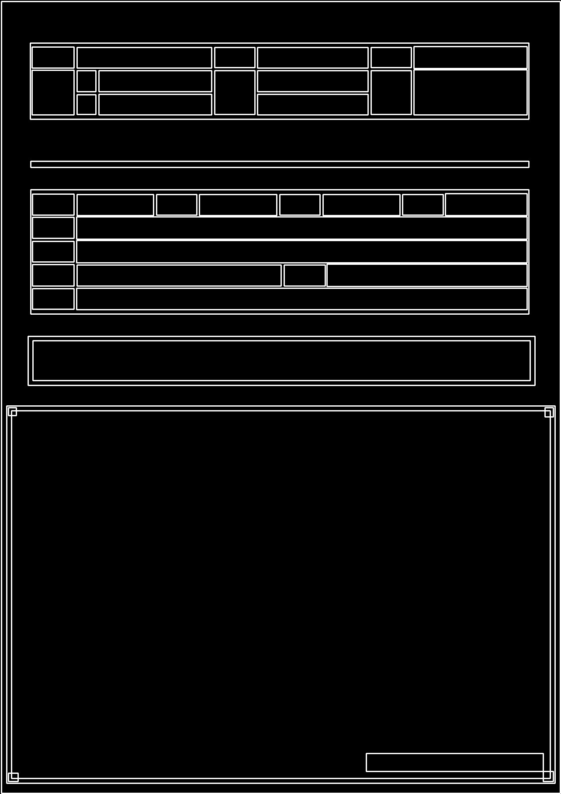

## Attempt! Line_image와 Erased_Line으로의 분리
위에서 추출한 `Line_image`를 원본 이미지에 **덮어씌워** 라인을 지운다.
**Problem!**
추출한 contours 사각형은 
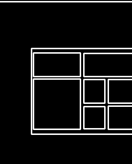

다음과 같이 contour사이에 **빈공간**이 존재!

### Trial
애초에 흰색 Contours 사각형을 그릴 때, 두께를 두껍게 해보자!

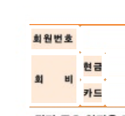

두께를 두껍게 하면 검출된 contours를 기준으로 두께를 늘리기 때문에 Text가 지워질 수 있고,
두께를 늘린 사각형은 기본적으로 모서리가 둥그스름하게 표현되므로 짜투리가 남게 된다.

## Solution!
### def morph_closing()
`cv2.morphologyEx()`의 `cv2.MORPH_CLOSE`를 이용하여 해결
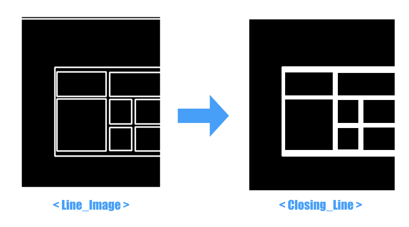

---
Closing 된 `Line_image`를 원본`Original_image`에 덮어씌워
`line_image(라인만 있는 이미지)`와 `Erased_line(라인이 지워진 이미지)`로 나눈다.

```python
self.erased_line = cv2.addWeighted(self.Origin_image, 1, self.line_image, 1, 0)
```
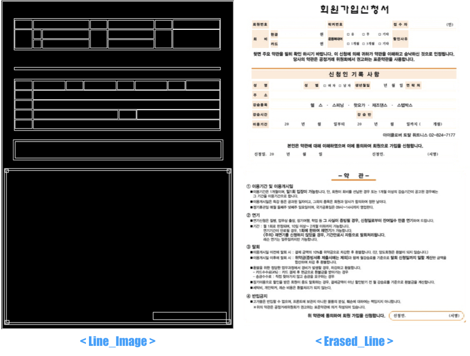


## Attempt! Cell 생성

지금까지 추출한 정보들을 바탕으로 **Document File**을 생성한다고 했을 때,
부족한 점들이 많다.

>1. 표의 줄, 칸은 몇 개로 설정해야 하는가?
>2. 어떤 Cell이 Merge되어 있는가?
>3. 경계선은 투명선인가? 실선인가?

따라서, 위의 과제들을 해결하기 위해서는
먼저,검출된 Contours를 바탕으로 필요한 Cell을 나누고 Cell의 정보를 저장해야한다.

### Trial
`needed_x[]`, `needed_y[]`라는 리스트를 만들고,
ContoursRect들의 `x, x+width, y, y+height`를 append하여 필요한 셀의 개수를 구해보자.
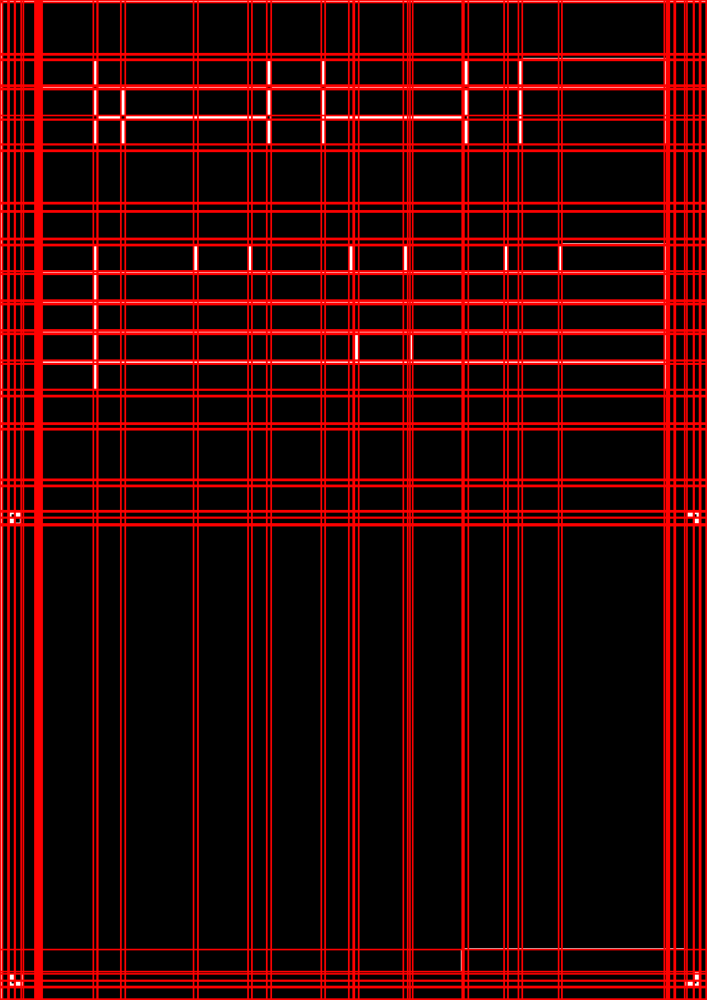
**Problem!**
경계선 또한 한 개의 Cell로 취급하며, 너무 많은 셀의 정보가 나온다


## Solution!
### def cal_cell_needed()
`minimum_w, _h` : 근사되는 x, y에 대한 정보를 압축하기 위한 최소값의 width, height를 저장해둘 변수

`final_x, _y` : 중복을 제거하고 근사된 x, y값을 담을 set()
`temp_int`를 이용해 minimum_w(최소 cell의 width)보다 작은 비슷한 값의 x, y들을 평균값으로 압축, 불필요한 셀의 낭비를 막는다.
이렇게 되면 결국 `len(final_x) - 1, len(final_y) - 1`이 필요한 x,y축 셀의 개수가 된다.

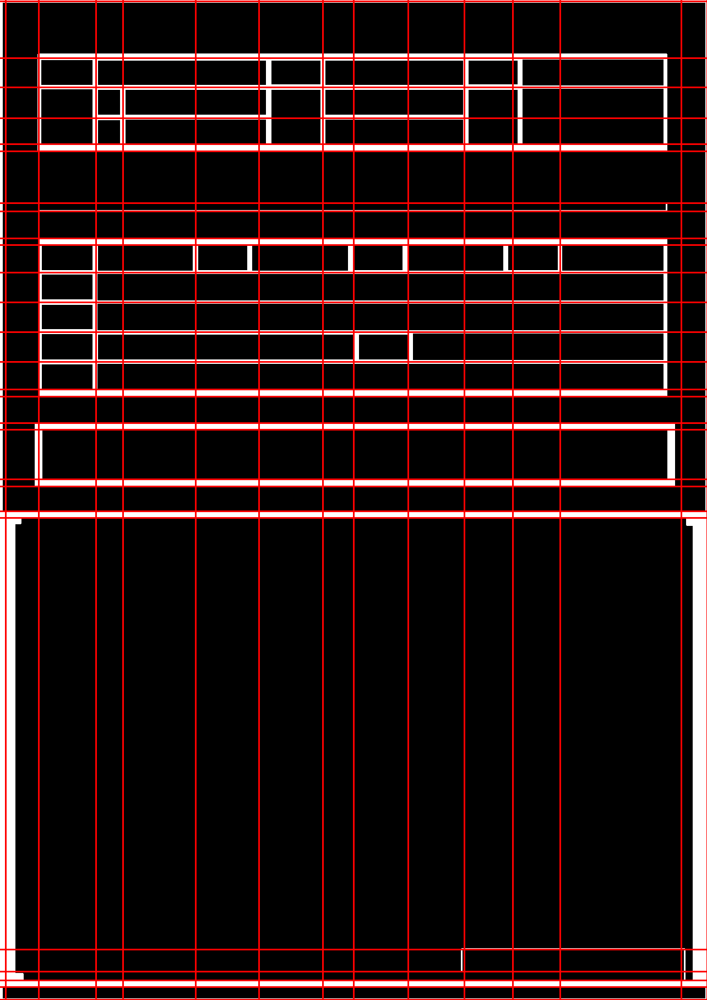

---

### def save_cell_value()

앞에서 구한 `final_x(x_axis)`, `final_y(y_axis)`의 정보를 이용.
Cell을 생성하고 정보를 저장하는 것은 어렵지 않다.
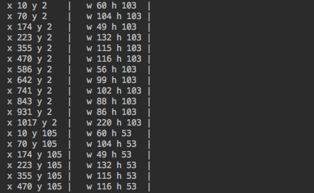


## Attempt! Find Cells' Boundary
### idea
이제 각각 나눠진 Cell들에 text를 저장하기 위해선 영역별로 **Cell을 Merge**해야한다.
Merge를 하려면

> - Cell 각각의 경계선이 존재하는지 알아야 한다.
> - `Line_image`를 이용하여, 각 Cell의 중앙으로 부터 상하좌우로 rgb값이 0이 아니면 경계선이 있는 것으로 판별
> - 가로를 기준으로 Cell의 Right경계가 있거나, 다음 Cell의 Left경계가 있다면 이는 경계가 있는 것
> - 만약, 경계가 없다면 두 셀을 Merge한다.

---

### def find_cell_boundary()
line_image(라인만 있는 이미지)는 검은 바탕에 하얀색으로 칠하였기 때문에
pixel을 받아와서 centeral 좌표를 기준으로 
상하좌우 b != 0인 값이 있다면 경계선(boundary)이 있는 것으로 판별!
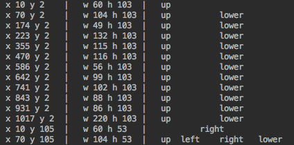

---

### def merge_cell()
OCR을 하기 전 Cell객체에 text를 담기 위해 line별로 세분화 되어 있는 셀을 적절하게 merge해야한다.
먼저, 문자나 Form양식의 특성상 가로쓰기가 주를 이루며 가로로 셀이 merge되어 있는 경우가 많으므로,
가로를 기준으로 Cell의 Right경계가 있거나, 다음 Cell의 Left경계가 있다면 이는 경계가 있는 것으로 판별하여 merge작업을 수행하며,
그 결과 값을 바탕으로 세로 merge를 수행한다.
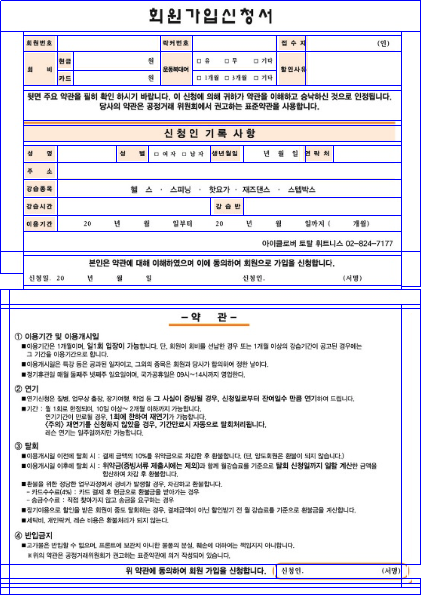

## Result!
### < Form 1 >
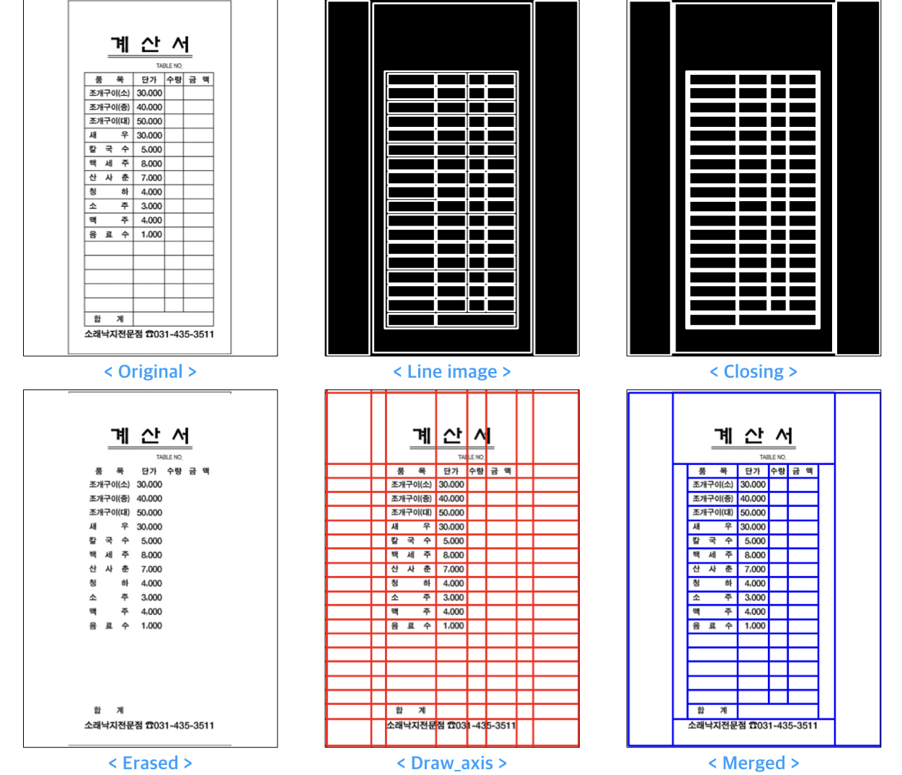

---

### < Form 2 >
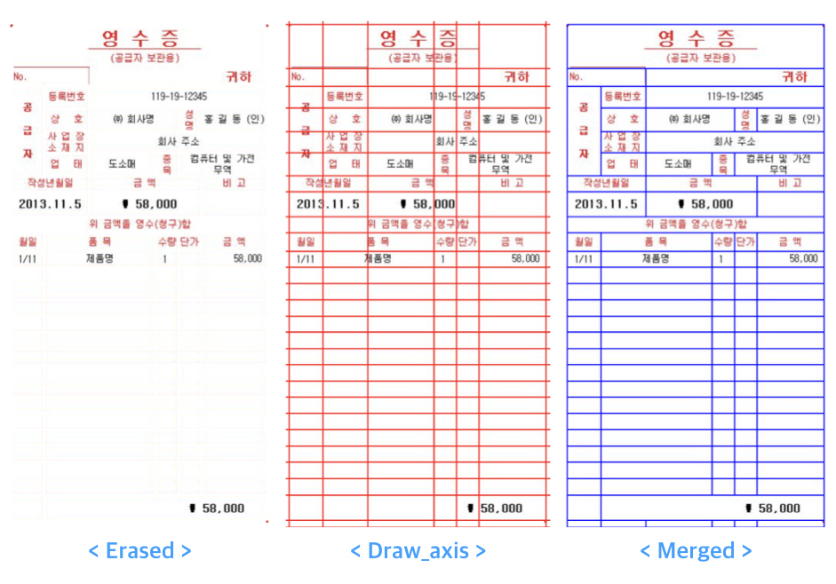

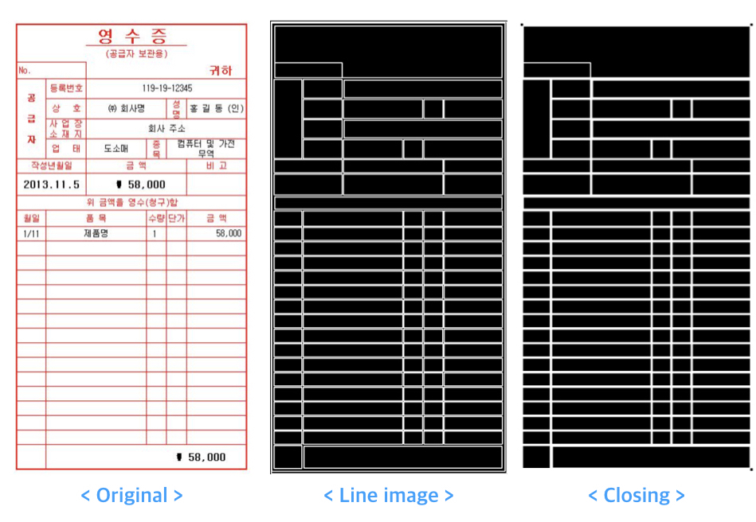

### < Extra >
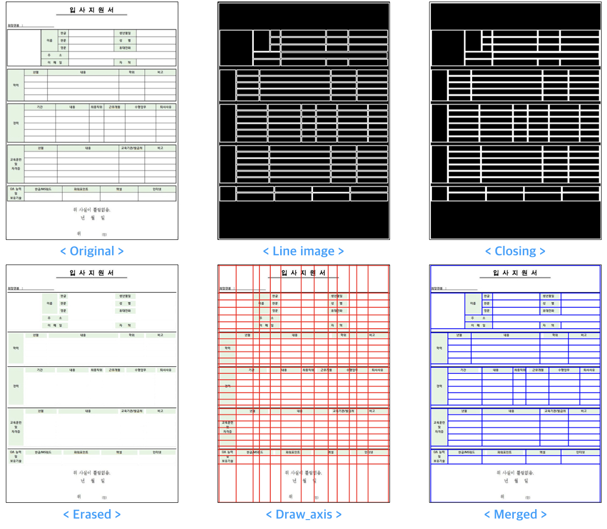

# 2) OCR cells

Preprocessing으로 적절히 나눠진 Cell영역 내의 Text를 OCR을 통해 유니코드로 변환하여야 합니다.


---

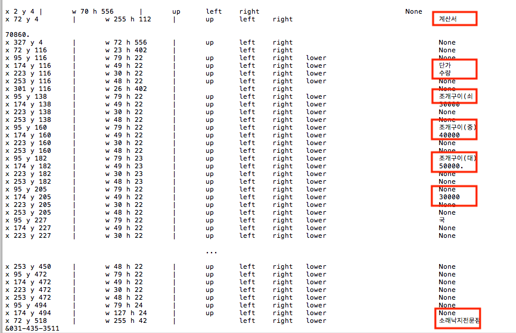

*작성중...*

# 3) export to document

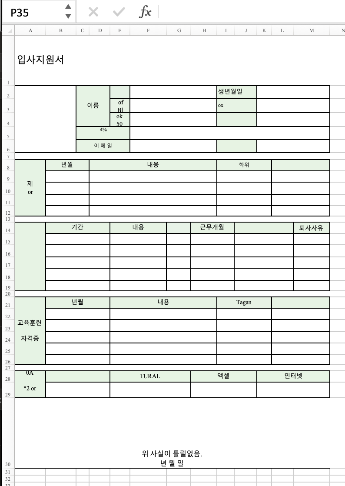

*작성중...*


# Todo

- 만약에 이 프로그램이 적절히 셀을 추출하지 못했다면, 처리되지 않는 contour는 사용자가 그릴 수 있게 해보자
- cell 객체에 속성 boundary에 대한 정보를 확대해야 할 것 같다.
  text_align이나 경계선의 색상과 같은 정보를 넣는다면 더 원본과 비슷한 document를 만들 수 있을 것이다.
- `cv2.findContour`의 윤곽인식이 기본이기 때문에 점선과 같은 선은 잘 인식하지 못한다. 개선이 필요!
- Tesseract OCR을 Machine learning시켜서 OCR의 정확도를 높인다면 더 완성도 높은 결과를 얻을 수 있을 것이다.
- OCR속도 향상을 위해 multi-processing을 적용하자.
